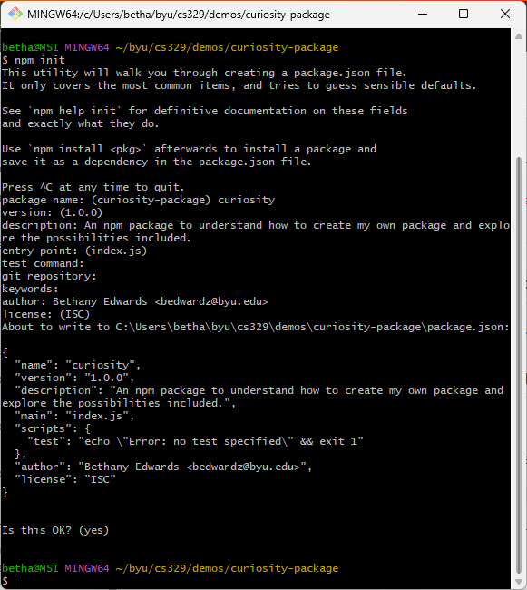

# Curiosity Report 04-12-2025
## Prompt: npm—what, how and why?  

### Why is this topic relevant? 
We have used many npm packages throughout this course, and at first I never bat an eye. I always thought I'd look into one of the specific packages, and research what the code actually does for us, but then I used the [pizza-logger]([url](https://www.npmjs.com/package/pizza-logger)) npm package made by [isawamoose]([url][https://www.npmjs.com/~isawamoose]). It hadn't occured to me until then that we can make our own npm packages; that it's not some abstract removed "for professionals only" development tool. Realizing npm is an open source tool for packaging code inspired me to look into how that can be done, how complicated the process is, and why it would be desired. 

### What is an npm package? 
An npm package is a reusable piece of JavaScript code designed to be installed and used in Node.js projects. 

> "Open source developers from every continent use npm to share and borrow packages, and many organizations use npm to manage private development as well"
> ([About npm]([url](https://docs.npmjs.com/about-npm))).

There are many uses for npm. The following are the uses which seem the most relevant to me. 
* Adapt packages of code for your apps, or incorporate packages as they are.
* Download standalone tools you can use right away.
* Share code with any npm user, anywhere.
* Update applications easily when underlying code is updated.

npm is a collaborative work space. It is encouraged to share packages publically (this option has no cost, whereas private packages require an upgraded account).


### How to make an npm package?
The first step to creating an npm package is making an account. Below is a link to the account I made.

> https://www.npmjs.com/~eddieblu

Having the most current version of Node.js and npm is an important prerequisite. The [npm docs]([url](https://docs.npmjs.com/getting-started)) provide all the instruction necessary to set up the local environment. 

Public packages require a package.json file. This can be created from CLI by creating a package directory and running ```npm init``` within. Command line will walk you through setting the fields for your package.json file. 



Organizations can only create and manage scoped packages, whereas user accounts (what I am setting up) can create and manage unscoped packages. The setup would be different for an organization. 