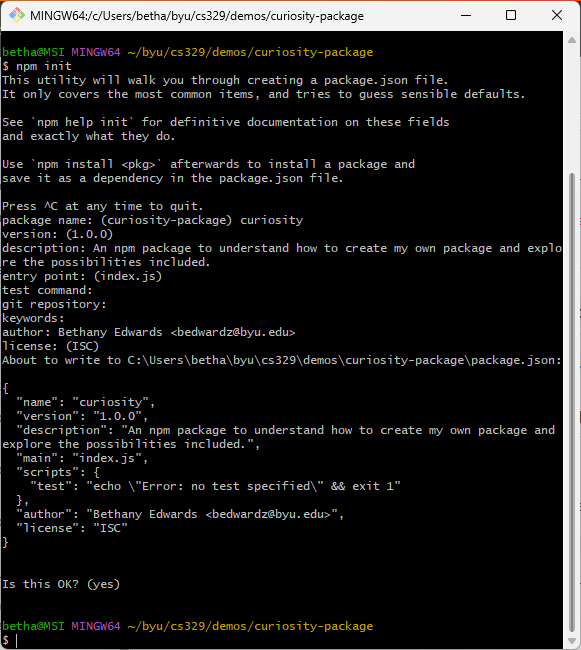
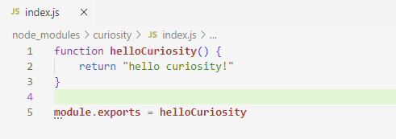
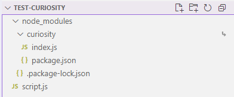
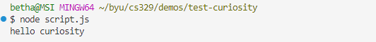
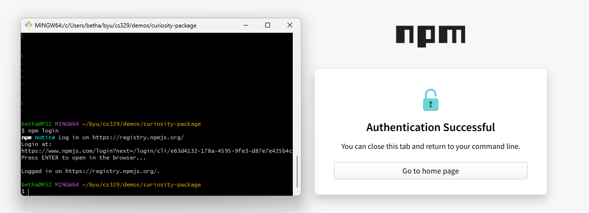
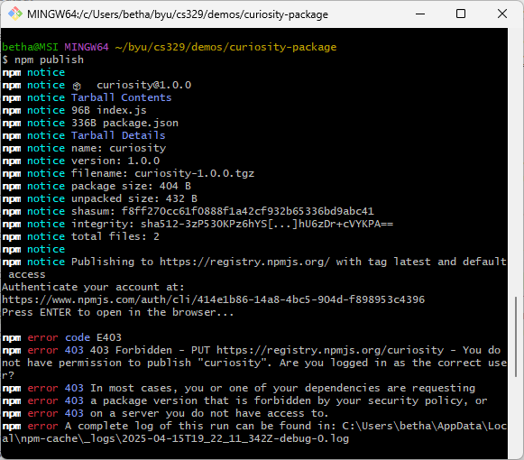
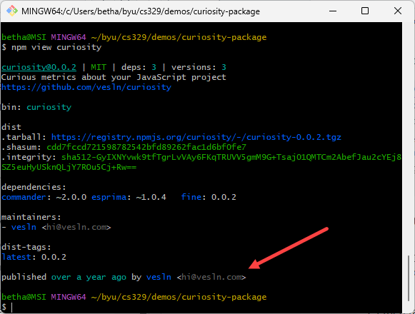
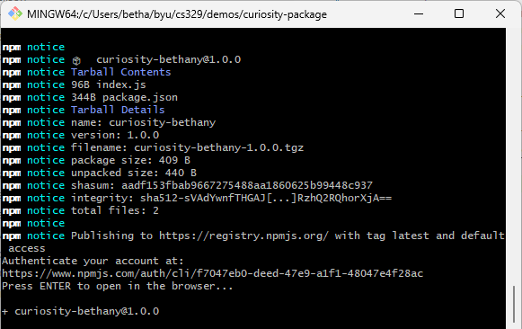
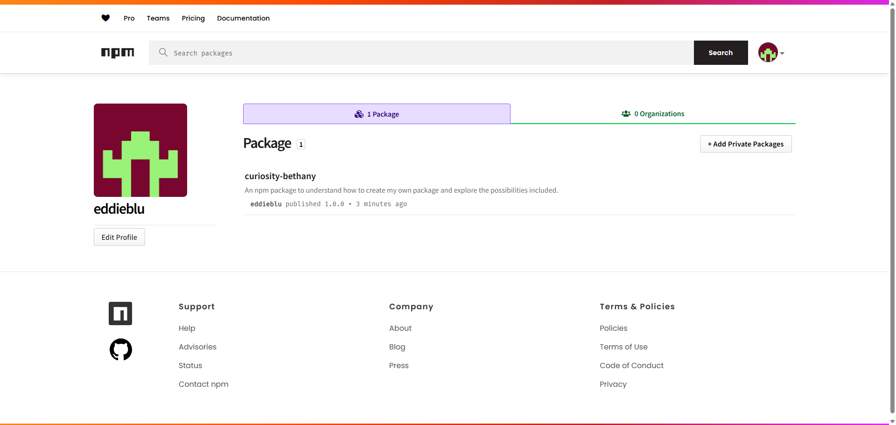

# Curiosity Report 04-12-2025
## Prompt: npm—what, how and why?  

### Why is this topic relevant? 
We have used many npm packages throughout this course, and at first I never bat an eye. I always thought I'd look into one of the specific packages, and research what the code actually does for us, but then I used the [pizza-logger]([url](https://www.npmjs.com/package/pizza-logger)) npm package made by [isawamoose]([url][https://www.npmjs.com/~isawamoose]). It hadn't occured to me until then that we can make our own npm packages; that it's not some abstract removed "for professionals only" development tool. Realizing npm is an open source tool for packaging code inspired me to look into how that can be done, how complicated the process is, and why it would be desired. 

## What is an npm package? 
An npm package is a reusable piece of JavaScript code designed to be installed and used in Node.js projects. 

> "Open source developers from every continent use npm to share and borrow packages, and many organizations use npm to manage private development as well"
> ([About npm]([url](https://docs.npmjs.com/about-npm))).

There are many uses for npm. The following are the uses which seem the most relevant to me. 
* Adapt packages of code for your apps, or incorporate packages as they are.
* Download standalone tools you can use right away.
* Share code with any npm user, anywhere.
* Update applications easily when underlying code is updated.

npm is a collaborative work space. It is encouraged to share packages publically (this option has no cost, whereas private packages require an upgraded account).


## How to make an npm package?

### Make an account
The first step to creating an npm package is making an account. Below is a link to the account I made.

> https://www.npmjs.com/~eddieblu

### Set up local environment

Having the most current version of Node.js and npm is an important prerequisite. The [npm docs]([url](https://docs.npmjs.com/getting-started)) provide all the instruction necessary to set up the local environment. I followed their published documentation and a couple of blog posts to know how to set up my own npm package.

### Create files for the npm package

Public packages require a package.json file. This can be created from CLI by creating a package directory and running `npm init` within. Command line will walk you through setting the fields for your `package.json` file. 



Organizations can only create and manage scoped packages, whereas user accounts (what I am setting up) can create and manage unscoped packages. The setup would be different for an organization. 

After creating the `package.json` file, you can create all of the code you want your package to have. The most important file to include is the one that will be loaded when the module is required by another application. In my package, that is a file called `index.js`.



### Testing the npm package 

Before publishing the package, there is a way to test if it works. These are the steps to testing the npm package.

1. In the root of the `package` project, run the command below. This creates a global link to your package and it can then be accessed from other folders.
```
npm link
```

2. I then created a separate `test-curiosity` directory with a (temporarily) empty `script.js` file. In this directory, I ran the command below where "curiosity" is the name of my package:
```
npm link curiosity
```
This added the node_modules for my npm package! 



3. My next step is to see if I can require my package. I modified `script.js` to use the curiosity package:

```
const helloCuriosity = require('curiosity');
console.log(helloCuriosity());
```

4. I then ran the following command in the root of the `test-curiosity` folder to test the performance of my npm package:



(It works)

## How to publish an npm package?

Once I was sure the package works the way it's supposed to (it's very simple, so there's no doubt) it's time to publish it. 

### Log in to npm
I had to log in to npm from the root of my package.



### Publish to npm
After being logged in successfully, next is officially publishing to npm.

> [!NOTE]
> At this point I tried to publish my package, but I couldn't. I found out it is because the name of my package is too generic ("curiosity") and was already taken as a public package. Here are some screenshots that show what I learned through this process:

Failing to publish:


Information of who owns the public `curiosity` package:


I renamed my package to `curiosity-bethany` and tried again to publish.



(It works)

### TADA


## Wrap up
There is still a lot more to explore with npm. I played around with a few more features, like releasing a new version so that I could include a README file in my package. 

Overall, I really enjoyed this project. It was cool to get hands-on experience exploring a new tool, even though it incldued messing up along the way. I agree with Professor Jensen that being curious is how CS majors stay successful. Our field is under ongoing development and if we never take the time to learn the new aspects, we'll get left behind. 

So, when in doubt, make an npm package yourself. 